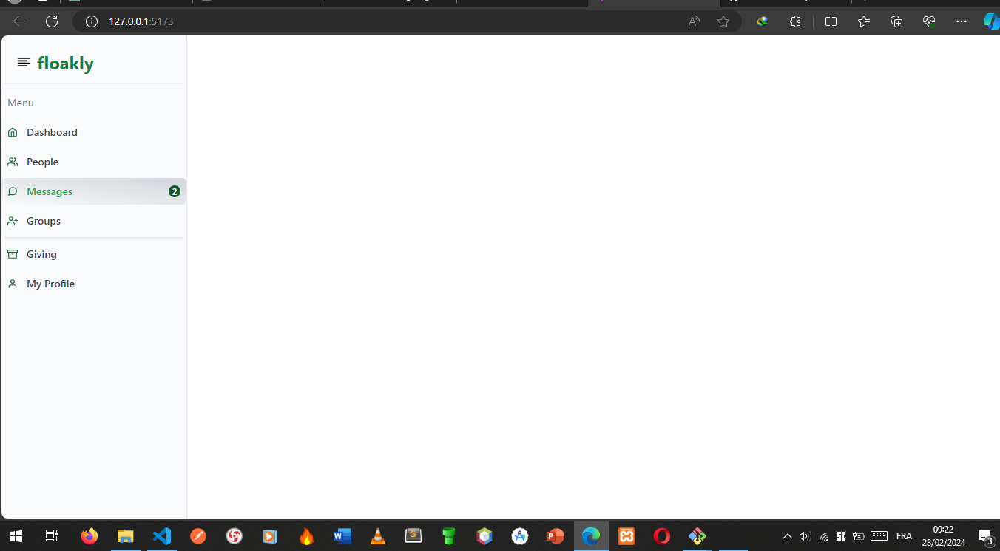

# Chat_Talioo

Conception et mise en œuvre une barre latérale intuitive pour améliorer la navigation et l'expérience utilisateur globale 

## Capture d'écran



## Installation

Suivez ces étapes pour installer et exécuter le projet localement.

1. Clonez le référentiel:

    ```bash
    git clone  https://github.com/Taliooo/CHAT_ANTONIO.git
    ```

2. Accédez au répertoire du projet:

    ```bash
    cd CHAT_ANTONIO
    ```

3. Installez les dépendances:

    ```bash
    pnpm install
    ```

## Auteur

Antonio Ramanandraibe

